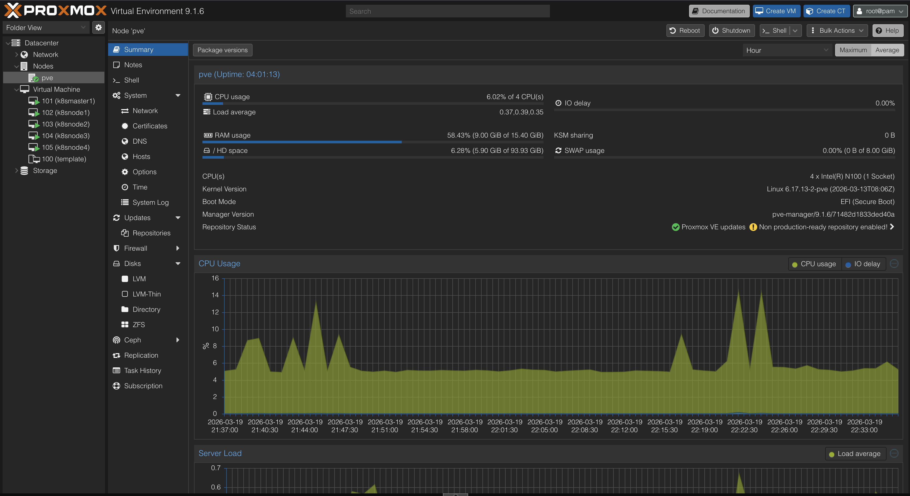

# 🛸 My HomeOps Lab

[](https://k3s.io/)
[](https://www.proxmox.com)
[](https://www.python.org/)
[](#)

Репозиторий содержит конфигурации, скрипты автоматизации и манифесты для моей домашней лаборатории. Основной фокус — на отказоустойчивости и изучении Cloud Native стека.

---

## 🏗 Hardware Stack

В основе лежит нода-MiniPC FireBat S1 на базе архитектуры Alder Lake-N.

| Компонент          | Спецификация                     |
| :----------------- | :------------------------------- |
| **CPU**            | 4 x Mini-PC Intel® N100 (4C/4T)  |
| **RAM**            | 16GB 2666Mhz                     |
| **ROM**            | 512Gb SSD                        |
| **Virtualization** | Proxmox VE 9.1.6                 |
| **Kernel**         | Linux 6.17.13-2-pve (2026-03-13) |
| **Boot Mode**      | EFI (Secure Boot Enabled)        |
<p align="left">
  
</p>

[Полные характеристики FireBat S1 MiniPC](https://anonim.xyz/go/https://firebatpc.net/product/detail/150009?type=4)

## 🎡 Software & Infrastructure

### 🚀 Kubernetes Cluster
Я использую **k3s** для легковесной оркестрации контейнеров.
* **CNI:** Cilium / Calico
* **Storage:** Longhorn / OpenEBS
* **Ingress:** Traefik / NGINX / Istio

### 🐍 Python Development & Testing
Лаборатория активно используется как полигон для разработки и тестирования Python-приложений:
* **Backend:** Развертывание микросервисов на **FastAPI** и **Flask**.
* **Async:** Тестирование асинхронных воркеров и очередей задач (Celery/RabbitMQ).
* **Cache:** Тестирование и эксплуатация кэшей (Valkey/Redis)
* **Automation:** Кастомные SDK и CLI-инструменты для управления инфраструктурой Proxmox/K3s.

### 🛠 Automation Tools
* **IAC:** Ansible для настройки Proxmox и развертывания K3s.
* **Scripting:** Основной язык автоматизации — **Python**.
* **GitOps:** ArgoCD
* **Monitoring:** Victoria Metrics / Victoria Traces / Victoria Logs

---

## 📂 Project Structure

```bash
.
├── ansible/          # Плейбуки для настройки хостов
├── k8s/              # Манифесты Kubernetes (apps, monitoring, storage)
└── apps/             # Исходный код тестируемых Python-приложений